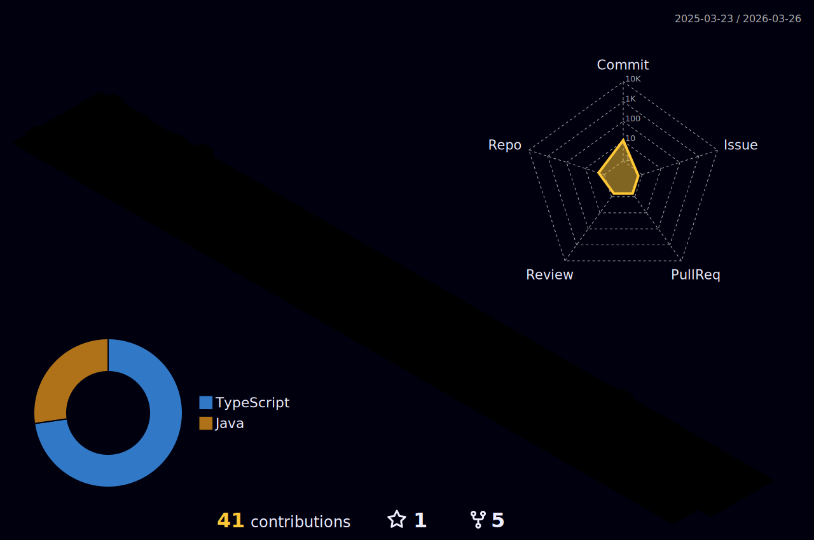

# Olá, eu sou Edvan Silva / Hello, i'm Edvan Silva 👔

Sou um desenvolvedor de software especializado em desenvolvimento full stack para a web, com forte capacidade de aprendizado rápido e foco em resultados. / 

I am a software developer specializing in full stack web development, with a strong ability for fast learning and a focus on results.

## Sobre Mim / About me ✨😊

- 🎓 **Formação / Education:** Atualmente cursando Análise e Desenvolvimento de Sistemas/ Currently studying Systems Analysis and Development
- 💼 **Interesses / Interests:** Desenvolvimento Web, Desenvolvimento FullStack, Ciência de Dados, DevOps, Automação. / Web Development, Full-Stack Development, Data Science, DevOps, Automation.
- 💻 **Habilidades Técnicas / Technical Skills:** HTML, CSS, Sass, JavaScript, Scrum, Node, Nest, Next, TypeScript, Prisma, Python, React,React Native Redux, Hooks, Styled Components, Tailwind, Bootstrap, MongoDb, MySQL, Docker, Express, Aws, Git, GitHub, Java, Context Api, Angular, Google cloud, Figma, MariaDb.

  
  
  

## 🌟 Projetos Relevantes / Relevant projects

### [Zacademy](https://github.com/edsay12/ZAcademy)

 Uma plataforma de cursos que oferece recursos para adicionar, comprar e visualizar uma variedade de cursos, proporcionando uma experiência de aprendizado completa e acessível para os usuários. / A course platform that offers features to add, purchase, and view a variety of courses, providing users with a comprehensive and accessible learning experience.

- **🛠️ Tecnologias Utilizadas / Technologies Used:**  Next, PrismaDB, Mysql, Docker, Use Query, React Hook Form, Next Auth, Oauth.
- **✨ Funcionalidades Principais / Main Features:** Visualização de cursos, Adição de comentarios, Carrinho de compras, etc.

### [Drive S3](https://github.com/edsay12/S3-Driver)

Uma aplicação web que simula um Google Drive, permitindo aos usuários armazenar, compartilhar e gerenciar arquivos, com a possibilidade de adicionar, baixar, arquivar, colocar na lixeira e resgatar itens.

- **🛠️ Tecnologias Utilizadas / Technologies Used:**  React, Typescript, Sass, Express,  Node,  Aws, S3, Docker, Cognito.
- **✨ Funcionalidades Principais / Main Features:** Armazenamento e gerenciamento de arquivos. / File storage and management.

### [ReactTube](https://github.com/edsay12/ReactTube)

Aplicação web que simula um YouTube permitindo a adição, visualização e compartilhamento de vídeos. / A web application that simulates Google Drive, allowing users to store, share, and manage files, with the ability to add, download, archive, trash, and recover items.

- **🛠️ Tecnologias Utilizadas / Technologies Used:** Node, React, TypeScript, MySql, MongoDb, Docker, AWS.
- **✨ Funcionalidades Principais / Main Features:** Posibilidade de adicionar videos, Fazer comentarios,
- Dar likes,Visualização de videos. / Ability to add videos, make comments, Liking.

## 💼 Experiência / Experience

### [Técnico em informatica PROCON-PE / IT technician at PROCON-PE]

Sou responsável pelo gerenciamento e implementação de aplicativos, além da gestão de rede. Minha função inclui criar documentações e relatórios, treinar usuários no uso de novas ferramentas e fornecer suporte técnico para garantir o bom funcionamento dos sistemas e a eficiência das operações. / I am responsible for the management and implementation of applications, as well as network management. My role includes creating documentation and reports, training users on the use of new tools, and providing technical support to ensure the smooth operation of systems and the efficiency of operations.

- **Período / Period:** 03/2024 - (em atuação / currently working)
- **Atividades Principais / Main Activities:** Desenvolvimento de Aplicações Web, manutenção de código existente,Elaboração de documentação Técnica, participação em reuniões de planejamento. / Web Application Development, maintenance of existing code, creation of technical documentation, participation in planning meetings.

## 📫 Contato / Contact

  
  
  
  
  
  
 
  
  <a href='https://www.linkedin.com/in/edvan-silva-396a14178/'>
      

## 🖖 GitHub Estatísticas / GitHub Statistics

  
